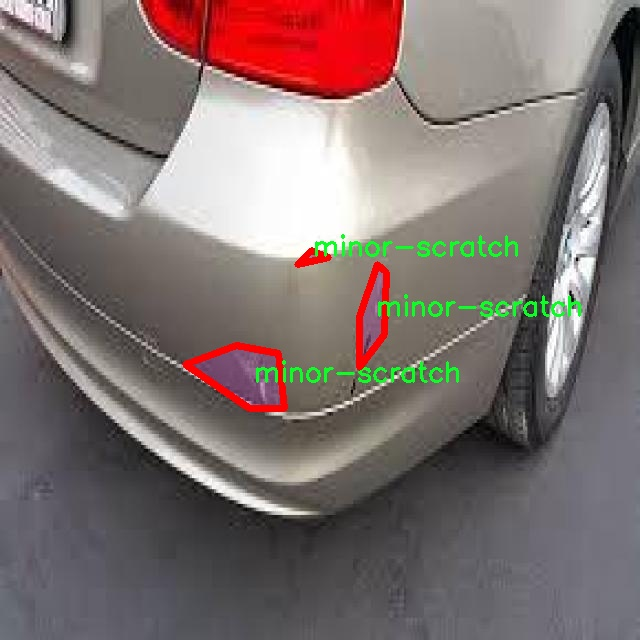

# 车辆损伤分割系统源码＆数据集分享
 [yolov8-seg-C2f-Faster-EMA＆yolov8-seg-C2f-EMSCP等50+全套改进创新点发刊_一键训练教程_Web前端展示]

### 1.研究背景与意义

项目参考[ILSVRC ImageNet Large Scale Visual Recognition Challenge](https://gitee.com/YOLOv8_YOLOv11_Segmentation_Studio/projects)

项目来源[AAAI Global Al lnnovation Contest](https://kdocs.cn/l/cszuIiCKVNis)

研究背景与意义

随着城市化进程的加快和汽车保有量的激增，交通事故及其引发的车辆损伤问题日益突出。车辆损伤不仅影响了车辆的外观和使用寿命，还可能对行车安全造成潜在威胁。因此，及时、准确地评估车辆损伤程度，成为了汽车维修、保险理赔及交通管理等领域亟待解决的重要问题。传统的车辆损伤评估方法主要依赖于人工检查，效率低下且容易受到主观因素的影响，难以保证评估结果的准确性和一致性。为此，基于计算机视觉和深度学习技术的自动化车辆损伤检测与分割系统应运而生，成为研究的热点。

YOLO（You Only Look Once）系列模型因其高效的实时目标检测能力而受到广泛关注。YOLOv8作为该系列的最新版本，在目标检测的精度和速度上都有了显著提升。然而，现有的YOLOv8模型在处理复杂场景中的车辆损伤分割任务时，仍然面临着一些挑战。例如，车辆损伤的种类繁多、损伤程度差异明显，且不同损伤类型在图像中的表现形式各异，这对模型的分割能力提出了更高的要求。因此，改进YOLOv8以适应车辆损伤分割任务，不仅具有重要的理论意义，也为实际应用提供了可行的解决方案。

本研究将基于改进YOLOv8的车辆损伤分割系统，利用包含2500张图像的“damage-severity”数据集进行训练和测试。该数据集涵盖了8种不同类别的车辆损伤，包括轻微凹陷、轻微划痕、中度破损、中度凹陷、中度划痕、严重破损、严重凹陷和严重划痕。这些类别的细分为模型的训练提供了丰富的样本，有助于提升模型对不同损伤类型的识别和分割能力。通过对这些损伤类别的深入分析，研究将探讨如何优化YOLOv8的网络结构和损失函数，以提高模型在复杂场景下的分割精度。

此外，研究还将关注模型在实际应用中的可推广性和鲁棒性。车辆损伤的拍摄环境、光照条件及视角变化等因素，都会对模型的性能产生影响。因此，如何增强模型对这些变化的适应能力，将是本研究的重要内容之一。通过引入数据增强技术、迁移学习等方法，期望在不同场景下都能保持较高的分割精度，从而为车辆损伤评估提供可靠的技术支持。

综上所述，基于改进YOLOv8的车辆损伤分割系统的研究，不仅有助于推动计算机视觉和深度学习技术在车辆损伤检测领域的应用，还将为交通安全、汽车维修及保险理赔等行业提供高效、准确的解决方案。通过提升车辆损伤评估的自动化水平，能够有效降低人工成本，提高工作效率，从而为构建更加安全、智能的交通环境贡献力量。

### 2.图片演示


##### 注意：由于此博客编辑较早，上面“2.图片演示”和“3.视频演示”展示的系统图片或者视频可能为老版本，新版本在老版本的基础上升级如下：（实际效果以升级的新版本为准）

  （1）适配了YOLOV8的“目标检测”模型和“实例分割”模型，通过加载相应的权重（.pt）文件即可自适应加载模型。

  （2）支持“图片识别”、“视频识别”、“摄像头实时识别”三种识别模式。

  （3）支持“图片识别”、“视频识别”、“摄像头实时识别”三种识别结果保存导出，解决手动导出（容易卡顿出现爆内存）存在的问题，识别完自动保存结果并导出到tempDir中。

  （4）支持Web前端系统中的标题、背景图等自定义修改，后面提供修改教程。

  另外本项目提供训练的数据集和训练教程,暂不提供权重文件（best.pt）,需要您按照教程进行训练后实现图片演示和Web前端界面演示的效果。

### 3.视频演示

[3.1 视频演示](https://www.bilibili.com/video/BV1cam5YNE3i/)

### 4.数据集信息展示

##### 4.1 本项目数据集详细数据（类别数＆类别名）

nc: 8
names: ['minor-dent', 'minor-scratch', 'moderate-broken', 'moderate-dent', 'moderate-scratch', 'severe-broken', 'severe-dent', 'severe-scratch']


##### 4.2 本项目数据集信息介绍

数据集信息展示

在现代计算机视觉领域，尤其是在自动驾驶和智能交通系统的研究中，车辆损伤的自动检测与分割成为了一个重要的研究方向。为此，我们构建了一个名为“damage-severity”的数据集，旨在为改进YOLOv8-seg的车辆损伤分割系统提供丰富的训练数据。该数据集包含了多种车辆损伤类型，具体分为八个类别，涵盖了从轻微到严重的不同损伤程度。这些类别分别是：轻微凹陷（minor-dent）、轻微划痕（minor-scratch）、中度破损（moderate-broken）、中度凹陷（moderate-dent）、中度划痕（moderate-scratch）、严重破损（severe-broken）、严重凹陷（severe-dent）以及严重划痕（severe-scratch）。

“damage-severity”数据集的构建过程经过精心设计，旨在确保数据的多样性和代表性。每个类别的样本均来自于不同类型的车辆，包括轿车、SUV、卡车等，确保数据集能够覆盖广泛的应用场景。数据集中每个损伤类别的图像均经过标注，标注信息包括损伤的具体位置、形状和大小等，确保在训练过程中，模型能够学习到准确的特征表示。此外，数据集中的图像在拍摄时考虑了不同的光照条件和背景环境，以增强模型的鲁棒性和泛化能力。

为了进一步提升模型的性能，数据集还包含了多种不同的损伤程度，这不仅有助于模型理解不同损伤的特征，还能在实际应用中提供更为细致的损伤评估。例如，轻微凹陷和轻微划痕的图像可能在视觉上与中度和严重损伤有显著差异，而这些细微的差别对于模型的训练至关重要。通过将这些不同程度的损伤样本纳入训练集，模型能够更好地识别和分割出各种损伤类型，从而在实际应用中提供更为准确的损伤检测结果。

在数据集的使用过程中，研究人员可以利用YOLOv8-seg模型进行训练，以实现高效的损伤分割。该模型在目标检测和分割任务中表现出色，能够在复杂的场景中快速准确地识别目标。通过对“damage-severity”数据集的训练，模型将能够在实时监测和评估车辆损伤时发挥重要作用，为事故处理、保险理赔和车辆维护等领域提供有效的技术支持。

总之，“damage-severity”数据集的构建为车辆损伤分割系统的研究提供了坚实的基础。通过对多样化损伤类型的细致标注和丰富样本的积累，该数据集不仅为YOLOv8-seg模型的训练提供了充足的数据支持，也为未来在车辆损伤检测领域的研究奠定了良好的基础。随着技术的不断进步，我们期待这一数据集能够推动智能交通系统的发展，为实现更安全、高效的交通环境贡献力量。





### 5.全套项目环境部署视频教程（零基础手把手教学）

[5.1 环境部署教程链接（零基础手把手教学）](https://www.bilibili.com/video/BV1jG4Ve4E9t/?vd_source=bc9aec86d164b67a7004b996143742dc)


[5.2 安装Python虚拟环境创建和依赖库安装视频教程链接（零基础手把手教学）](https://www.bilibili.com/video/BV1nA4VeYEze/?vd_source=bc9aec86d164b67a7004b996143742dc)

### 6.手把手YOLOV8-seg训练视频教程（零基础小白有手就能学会）

[6.1 手把手YOLOV8-seg训练视频教程（零基础小白有手就能学会）](https://www.bilibili.com/video/BV1cA4VeYETe/?vd_source=bc9aec86d164b67a7004b996143742dc)


按照上面的训练视频教程链接加载项目提供的数据集，运行train.py即可开始训练



     Epoch   gpu_mem       box       obj       cls    labels  img_size
     1/200     0G   0.01576   0.01955  0.007536        22      1280: 100%|██████████| 849/849 [14:42<00:00,  1.04s/it]
               Class     Images     Labels          P          R     mAP@.5 mAP@.5:.95: 100%|██████████| 213/213 [01:14<00:00,  2.87it/s]
                 all       3395      17314      0.994      0.957      0.0957      0.0843

     Epoch   gpu_mem       box       obj       cls    labels  img_size
     2/200     0G   0.01578   0.01923  0.007006        22      1280: 100%|██████████| 849/849 [14:44<00:00,  1.04s/it]
               Class     Images     Labels          P          R     mAP@.5 mAP@.5:.95: 100%|██████████| 213/213 [01:12<00:00,  2.95it/s]
                 all       3395      17314      0.996      0.956      0.0957      0.0845

     Epoch   gpu_mem       box       obj       cls    labels  img_size
     3/200     0G   0.01561    0.0191  0.006895        27      1280: 100%|██████████| 849/849 [10:56<00:00,  1.29it/s]
               Class     Images     Labels          P          R     mAP@.5 mAP@.5:.95: 100%|███████   | 187/213 [00:52<00:00,  4.04it/s]
                 all       3395      17314      0.996      0.957      0.0957      0.0845


### 7.50+种全套YOLOV8-seg创新点代码加载调参视频教程（一键加载写好的改进模型的配置文件）

[7.1 50+种全套YOLOV8-seg创新点代码加载调参视频教程（一键加载写好的改进模型的配置文件）](https://www.bilibili.com/video/BV1Hw4VePEXv/?vd_source=bc9aec86d164b67a7004b996143742dc)

### 8.YOLOV8-seg图像分割算法原理

原始YOLOv8-seg算法原理

YOLOv8-seg是YOLO系列算法中的一个重要版本，专注于目标检测与图像分割的结合，旨在为复杂场景下的视觉任务提供更高的精度和效率。该算法由Ultralytics公司于2023年发布，基于YOLOv7的成功经验，进行了多方面的优化与改进，形成了一个更加深层次的卷积神经网络结构。YOLOv8-seg不仅在目标检测方面表现出色，还引入了图像分割的能力，使其在处理图像时能够更精确地识别和分割出目标物体。

YOLOv8-seg的核心思想是将整个图像作为输入，直接在图像上进行目标检测和分割，而不需要依赖传统的滑动窗口或区域提议方法。这种设计大大提高了检测的速度和精度，使得YOLOv8-seg能够在实时应用中表现出色。该算法的网络结构主要由三个部分组成：主干网络（Backbone）、特征增强网络（Neck）和检测头（Head）。每个部分都经过精心设计，以确保模型在处理复杂图像时的高效性和准确性。

在主干网络部分，YOLOv8-seg采用了CSPNet的设计理念，使用了C2F模块替代了YOLOv5中的C3模块。C2F模块通过并行化更多的梯度流分支，能够在保证模型轻量化的同时，提取更丰富的特征信息。这种改进使得YOLOv8-seg在处理不同尺度的目标时，能够更好地捕捉到细节，从而提升了整体的检测精度。

特征增强网络部分则引入了PAN-FPN的思想，通过不同层次的特征融合，YOLOv8-seg能够有效地整合来自主干网络的多尺度特征。这种特征融合策略不仅提高了模型对小目标的检测能力，还增强了模型在复杂背景下的鲁棒性。特征增强网络的设计使得YOLOv8-seg在处理不同场景时，能够更好地适应各种变化，提高了模型的泛化能力。

在检测头部分，YOLOv8-seg采用了解耦头的设计，将目标分类和边界框回归任务分开处理。这种解耦设计使得每个任务能够更加专注于自身的目标，从而有效地减少了复杂场景下的定位误差和分类错误。此外，YOLOv8-seg摒弃了传统的Anchor-based方法，转而采用Anchor-free的目标检测策略。这一策略通过直接回归目标的位置和大小，简化了模型的设计，同时提高了检测的灵活性和准确性。

YOLOv8-seg还引入了多尺度训练和测试的技术，允许模型在不同的输入尺寸下进行训练和推理。这种方法不仅提高了模型的适应性，还增强了其在实际应用中的表现。通过对输入图像进行自适应缩放，YOLOv8-seg能够在保持高效性的同时，最大限度地减少信息的冗余，从而提高目标检测和分割的速度。

在损失函数的设计上，YOLOv8-seg采用了DFL（Distribution Focal Loss）和CIoU（Complete Intersection over Union）损失函数的组合。这种损失函数的设计旨在使模型能够快速聚焦于标签附近的区域，从而提高了预测的准确性。通过这种方式，YOLOv8-seg能够在训练过程中更好地学习到目标的特征，进而提升检测和分割的效果。

综上所述，YOLOv8-seg算法通过对网络结构的优化、特征融合策略的改进以及损失函数的创新，成功地将目标检测与图像分割结合在一起，形成了一个高效、准确的视觉处理模型。该算法不仅在学术研究中具有重要的意义，也为实际应用提供了强有力的支持。无论是在智能监控、自动驾驶还是人脸识别等领域，YOLOv8-seg都展现出了其卓越的性能和广泛的适用性，成为当前目标检测与分割领域的一个重要里程碑。


### 9.系统功能展示（检测对象为举例，实际内容以本项目数据集为准）

图9.1.系统支持检测结果表格显示

  图9.2.系统支持置信度和IOU阈值手动调节

  图9.3.系统支持自定义加载权重文件best.pt(需要你通过步骤5中训练获得)

  图9.4.系统支持摄像头实时识别

  图9.5.系统支持图片识别

  图9.6.系统支持视频识别

  图9.7.系统支持识别结果文件自动保存

  图9.8.系统支持Excel导出检测结果数据


### 10.50+种全套YOLOV8-seg创新点原理讲解（非科班也可以轻松写刊发刊，V11版本正在科研待更新）

#### 10.1 由于篇幅限制，每个创新点的具体原理讲解就不一一展开，具体见下列网址中的创新点对应子项目的技术原理博客网址【Blog】：


[10.1 50+种全套YOLOV8-seg创新点原理讲解链接](https://gitee.com/qunmasj/good)

#### 10.2 部分改进模块原理讲解(完整的改进原理见上图和技术博客链接)【如果此小节的图加载失败可以通过CSDN或者Github搜索该博客的标题访问原始博客，原始博客图片显示正常】
### 深度学习基础
卷积神经网络通过使用具有共享参数的卷积运算显著降低了模型的计算开销和复杂性。在LeNet、AlexNet和VGG等经典网络的驱动下，卷积神经网络现在已经建立了一个完整的系统，并在深度学习领域形成了先进的卷积神经网络模型。

感受野注意力卷积RFCBAMConv的作者在仔细研究了卷积运算之后获得了灵感。对于分类、目标检测和语义分割任务，一方面，图像中不同位置的对象的形状、大小、颜色和分布是可变的。在卷积操作期间，卷积核在每个感受野中使用相同的参数来提取信息，而不考虑来自不同位置的差分信息。这限制了网络的性能，这已经在最近的许多工作中得到了证实。

另一方面，卷积运算没有考虑每个特征的重要性，这进一步影响了提取特征的有效性，并最终限制了模型的性能。此外，注意力机制允许模型专注于重要特征，这可以增强特征提取的优势和卷积神经网络捕获详细特征信息的能力。因此，注意力机制在深度学习中得到了广泛的应用，并成功地应用于各个领域。

通过研究卷积运算的内在缺陷和注意力机制的特点，作者认为现有的空间注意力机制从本质上解决了卷积运算的参数共享问题，但仍局限于对空间特征的认知。对于较大的卷积核，现有的空间注意力机制并没有完全解决共享参数的问题。此外，他们无法强调感受野中每个特征的重要性，例如现有的卷积块注意力模块（CBAM）和 Coordinate注意力（CA）。

因此，[参考该博客提出了一种新的感受野注意力机制（RFA）](https://qunmasj.com)，它完全解决了卷积核共享参数的问题，并充分考虑了感受野中每个特征的重要性。通过RFA设计的卷积运算（RFAConv）是一种新的卷积运算，可以取代现有神经网络中的标准卷积运算。RFAConv通过添加一些参数和计算开销来提高网络性能。

大量关于Imagnet-1k、MS COCO和VOC的实验已经证明了RFAConv的有效性。作为一种由注意力构建的新型卷积运算，它超过了由CAM、CBAM和CA构建的卷积运算（CAMConv、CBAMConv、CAConv）以及标准卷积运算。

此外，为了解决现有方法提取感受野特征速度慢的问题，提出了一种轻量级操作。在构建RFAConv的过程中，再次设计了CA和CBAM的升级版本，并进行了相关实验。作者认为当前的空间注意力机制应该将注意力放在感受野空间特征上，以促进当前空间注意力机制的发展，并再次增强卷积神经网络架构的优势。


### 卷积神经网络架构
出色的神经网络架构可以提高不同任务的性能。卷积运算作为卷积神经网络的一种基本运算，推动了人工智能的发展，并为车辆检测、无人机图像、医学等先进的网络模型做出了贡献。He等人认为随着网络深度的增加，该模型将变得难以训练并产生退化现象，因此他们提出了残差连接来创新卷积神经网络架构的设计。Huang等人通过重用特征来解决网络梯度消失问题，增强了特征信息，他们再次创新了卷积神经网络架构。

通过对卷积运算的详细研究，Dai等人认为，具有固定采样位置的卷积运算在一定程度上限制了网络的性能，因此提出了Deformable Conv，通过学习偏移来改变卷积核的采样位置。在Deformable Conv的基础上，再次提出了Deformable Conv V2和Deformable Conv V3，以提高卷积网络的性能。

Zhang等人注意到，组卷积可以减少模型的参数数量和计算开销。然而，少于组内信息的交互将影响最终的网络性能。1×1的卷积可以与信息相互作用。然而，这将带来更多的参数和计算开销，因此他们提出了无参数的“通道Shuffle”操作来与组之间的信息交互。

Ma等人通过实验得出结论，对于参数较少的模型，推理速度不一定更快，对于计算量较小的模型，推理也不一定更快。经过仔细研究提出了Shufflenet V2。

YOLO将输入图像划分为网格，以预测对象的位置和类别。经过不断的研究，已经提出了8个版本的基于YOLO的目标检测器，如YOLOv5、YOLOv7、YOLOv8等。上述卷积神经网络架构已经取得了巨大的成功。然而，它们并没有解决提取特征过程中的参数共享问题。本文的工作从注意力机制开始，从一个新的角度解决卷积参数共享问题。

### 注意力机制
注意力机制被用作一种提高网络模型性能的技术，使其能够专注于关键特性。注意力机制理论已经在深度学习中建立了一个完整而成熟的体系。Hu等人提出了一种Squeeze-and-Excitation（SE）块，通过压缩特征来聚合全局通道信息，从而获得与每个通道对应的权重。Wang等人认为，当SE与信息交互时，单个通道和权重之间的对应关系是间接的，因此设计了高效通道注Efficient Channel Attention力（ECA），并用自适应kernel大小的一维卷积取代了SE中的全连接（FC）层。Woo等人提出了卷积块注意力模块（CBAM），它结合了通道注意力和空间注意力。作为一个即插即用模块，它可以嵌入卷积神经网络中，以提高网络性能。

尽管SE和CBAM已经提高了网络的性能。Hou等人仍然发现压缩特征在SE和CBAM中丢失了太多信息。因此，他们提出了轻量级Coordinate注意力（CA）来解决SE和CBAM中的问题。Fu等人计了一个空间注意力模块和通道注意力模块，用于扩展全卷积网络（FCN），分别对空间维度和通道维度的语义相关性进行建模。Zhang等人在通道上生成不同尺度的特征图，以建立更有效的通道注意力机制。

本文从一个新的角度解决了标准卷积运算的参数共享问题。这就是将注意力机制结合起来构造卷积运算。尽管目前的注意力机制已经获得了良好的性能，但它们仍然没有关注感受野的空间特征。因此，设计了具有非共享参数的RFA卷积运算，以提高网络的性能。


#### 回顾标准卷积
以标准卷积运算为基础构建卷积神经网络，通过共享参数的滑动窗口提取特征信息，解决了全连接层构建的神经网络的固有问题（即参数数量大、计算开销高）。

设表示输入特征图，其中、和分别表示特征图的通道数、高度和宽度。为了能够清楚地展示卷积核提取特征信息的过程，以为例。提取每个感受野slider的特征信息的卷积运算可以表示如下：


这里，表示在每次卷积slider操作之后获得的值，表示在每个slider内的相应位置处的像素值。表示卷积核，表示卷积核中的参数数量，表示感受野slider的总数。

可以看出，每个slider内相同位置的特征共享相同的参数。因此，标准的卷积运算无法感知不同位置带来的差异信息，这在一定程度上限制了卷积神经网络的性能。

#### 回顾空间注意力
目前，空间注意力机制使用通过学习获得的注意力图来突出每个特征的重要性。与上一节类似，以为例。突出关键特征的空间注意力机制可以简单地表达如下：


这里，表示在加权运算之后获得的值。和分别表示输入特征图和学习注意力图在不同位置的值，是输入特征图的高度和宽度的乘积，表示像素值的总数。一般来说，整个过程可以简单地表示在图1中。


#### 空间注意力与标准卷积
众所周知，将注意力机制引入卷积神经网络可以提高网络的性能。通过标准的卷积运算和对现有空间注意力机制的仔细分析。作者认为空间注意力机制本质上解决了卷积神经网络的固有缺点，即共享参数的问题。

目前，该模型最常见的卷积核大小为1×1和3×3。引入空间注意力机制后用于提取特征的卷积操作是1×1或3×3卷积操作。这个过程可以直观地显示出来。空间注意力机制被插入到1×1卷积运算的前面。通过注意力图对输入特征图进行加权运算（Re-weight“×”），最后通过1×1卷积运算提取感受野的slider特征信息。

整个过程可以简单地表示如下：


 

这里，卷积核仅表示一个参数值。如果将的值作为一个新的卷积核参数，那么有趣的是，通过1×1卷积运算提取特征时的参数共享问题得到了解决。然而，空间注意力机制的传说到此结束。当空间注意力机制被插入到3×3卷积运算的前面时。具体情况如下：


如上所述，如果取的值。作为一种新的卷积核参数，上述方程完全解决了大规模卷积核的参数共享问题。然而，最重要的一点是，卷积核在每个感受野slider中提取将共享部分特征的特征。换句话说，在每个感受野slider内都会有重叠。

经过仔细分析发现，，…，空间注意力图的权重在每个slider内共享。因此，空间注意机制不能解决大规模卷积核共享参数的问题，因为它们不注意感受野的空间特征。在这种情况下，空间注意力机制是有限的。
#### 创新空间注意力与标准卷积
RFA是为了解决空间注意力机制问题而提出的，创新了空间注意力。使用与RFA相同的思想，一系列空间注意力机制可以再次提高性能。RFA设计的卷积运算可以被视为一种轻量级的即插即用模块，以取代标准卷积，从而提高卷积神经网络的性能。因此，作者认为空间注意力机制和标准卷积在未来将有一个新的春天。

感受野的空间特征：

现在给出感受野空间特征的定义。它是专门为卷积核设计的，并根据kernel大小动态生成，如图2所示，以3×3卷积核为例。


在图2中，“空间特征”表示原始特征图，等于空间特征。“感受野空间特征”表示变换后的特征，该特征由每个感受野slider滑块组成，并且不重叠。也就是说，“感受野空间特征”中的每个3×3大小的slider表示提取原始3×3卷积特征时所有感觉野slider的特征。

#### 感受野注意力卷积(RFA):

关于感受野空间特征，该博客的作者提出了感受野注意（RFA），它不仅强调了感受野slider内各种特征的重要性，而且还关注感受野空间特性，以彻底解决卷积核参数共享的问题。感受野空间特征是根据卷积核的大小动态生成的，因此，RFA是卷积的固定组合，不能脱离卷积运算的帮助，卷积运算同时依赖RFA来提高性能。

因此，作者提出了感受野注意力卷积（RFAConv）。具有3×3大小卷积核的RFAConv的总体结构如图3所示。


目前，提取感受野特征最常用的方法速度较慢，因此经过不断探索提出了一种快速的方法，通过分组卷积来取代原来的方法。

具体来说，根据感受野大小，使用相应的组卷积大小来动态生成展开特征。尽管与原始的无参数方法（如Pytorch提供的nn.Unfld()）相比，该方法添加了一些参数，但速度要快得多。

注意：正如在上一节中提到的，当原始的3×3卷积核提取特征时，感受野空间特征中的每个3×3大小的窗口表示所有感受野滑块的特征。但在快速分组卷积提取感受野特征后，由于原始方法太慢，它们会被映射到新的特征中。

最近的一些工作已经证明信息交互可以提高网络性能。类似地，对于RFAConv，与感受野特征信息交互以学习注意力图可以提高网络性能，但与每个感受野特征交互将带来额外的计算开销。为了确保少量的计算开销和参数数量，通过探索使用AvgPool池化每个感受野特征的全局信息，然后通过1×1组卷积运算与信息交互。最后，softmax用于强调感受野特征中每个特征的重要性。通常，RFA的计算可以表示为：


表示分组卷积，表示卷积核的大小，代表规范化，表示输入特征图，是通过将注意力图与变换的感受野空间特征相乘而获得的。

与CBAM和CA不同，RFA可以为每个感受野特征生成注意力图。标准卷积受到卷积神经网络性能的限制，因为共享参数的卷积运算对位置带来的差异信息不敏感。RFA完全可以解决这个问题，具体细节如下：


由于RFA获得的特征图是“调整形状”后不重叠的感受野空间特征，因此通过池化每个感受野滑块的特征信息来学习学习的注意力图。换句话说，RFA学习的注意力图不再在每个感受野slider内共享，并且是有效的。这完全解决了现有的CA和CBAM对大尺寸kernel的注意力机制中的参数共享问题。

同时，RFA给标准卷积核带来了相当大的好处，但调整形状后，特征的高度和宽度是k倍，需要进行k×k的stride卷积运算，才能提取特征信息。RFAConv创新了标准卷积运算。

此外，空间注意力机制将得到升级，因为作者认为现有的空间注意力机制应该专注于感受野空间特征，以提高网络的性能。众所周知，基于自注意力机制的网络模型取得了巨大的成功，因为它解决了卷积参数共享的问题，并对远程信息进行了建模，但基于自注意力机理的方法给模型带来了巨大的计算开销和复杂性。作者认为通过将一些现有空间注意力机制的注意力放在感受野空间特征中，它以轻量级的方式解决了自注意力机制的问题。

答案如下：

将关注感受野空间特征的空间注意力与卷积相匹配，完全解决了卷积参数共享的问题；

当前的空间注意力机制本身具有考虑远距离信息的特点，它们通过全局平均池化或全局最大池化来获得全局信息，这在一定程度上考虑了远距离信息。


为此，作者设计了一种新的CBAM和CA，称为RFACBAM和RFACA，它专注于感受野的空间特征。与RFA类似，使用stride为k的k×k的最终卷积运算来提取特征信息，具体结构如图4和图5所示，将这2种新的卷积方法称为RFCBAMConv和RFCAConv。比较原始的CBAM，使用SE注意力来代替RFCBAM中的CAM。因为这样可以减少计算开销。


此外，在RFCBAM中，通道和空间注意力不是在单独的步骤中执行的，因为通道和空间注意力是同时加权的，从而允许在每个通道上获得的注意力图是不同的。


### 11.项目核心源码讲解（再也不用担心看不懂代码逻辑）

#### 11.1 chinese_name_list.py

以下是对提供代码的逐行分析和核心部分的保留，同时添加了详细的中文注释：

```python
# -*- coding: utf-8 -*-  # 指定文件编码为UTF-8，以支持中文字符

# 创建一个字典，包含中文名称与其对应的英文标签
Chinese_name = {'person': "人"}

# 从字典中提取所有的中文名称，生成一个列表
Label_list = list(Chinese_name.values())

# 此时，Label_list 将包含 ['人']，即字典中所有值的列表
```

### 核心部分分析
1. **字典的创建**：`Chinese_name` 字典用于存储英文标签与其对应的中文名称。字典的键是英文，值是中文。
2. **列表的生成**：`Label_list` 通过 `list(Chinese_name.values())` 从字典中提取所有的值（即中文名称），并将其转换为列表。

### 代码功能总结
这段代码的主要功能是将一个包含英文标签的字典转换为一个只包含中文名称的列表。

这个程序文件的名称是 `chinese_name_list.py`，它的主要功能是定义一个包含中文名称的字典，并从中提取出一个标签列表。

首先，文件开头的 `# -*- coding: utf-8 -*-` 是一个编码声明，表明该文件使用 UTF-8 编码。这对于处理中文字符非常重要，因为 UTF-8 能够正确表示各种语言的字符。

接下来，程序定义了一个字典 `Chinese_name`，其中包含一个键值对。键是 `'person'`，值是 `"人"`。这个字典的目的是将英文单词与其对应的中文翻译进行关联。在这个例子中，`'person'` 这个英文单词被翻译为中文的 `"人"`。

然后，程序通过 `list(Chinese_name.values())` 创建了一个列表 `Label_list`，这个列表包含了字典 `Chinese_name` 中所有的值。在这里，由于字典中只有一个键值对，因此 `Label_list` 将只包含一个元素，即 `"人"`。

总的来说，这个文件的作用是将英文名称与中文名称进行映射，并将中文名称提取到一个列表中，以便后续使用。这个结构简单明了，适合用于需要处理多语言标签的场景。

#### 11.2 ultralytics\nn\backbone\VanillaNet.py

以下是简化后的核心代码部分，并附上详细的中文注释：

```python
import torch
import torch.nn as nn
import torch.nn.functional as F
from timm.layers import weight_init

# 定义激活函数类
class Activation(nn.ReLU):
    def __init__(self, dim, act_num=3, deploy=False):
        super(Activation, self).__init__()
        self.deploy = deploy
        # 初始化权重和偏置
        self.weight = torch.nn.Parameter(torch.randn(dim, 1, act_num*2 + 1, act_num*2 + 1))
        self.bn = nn.BatchNorm2d(dim, eps=1e-6)  # 批归一化
        weight_init.trunc_normal_(self.weight, std=.02)  # 权重初始化

    def forward(self, x):
        # 前向传播
        if self.deploy:
            return F.conv2d(super(Activation, self).forward(x), self.weight, padding=(self.act_num*2 + 1)//2, groups=self.dim)
        else:
            return self.bn(F.conv2d(super(Activation, self).forward(x), self.weight, padding=self.act_num, groups=self.dim))

    def switch_to_deploy(self):
        # 切换到部署模式，融合批归一化
        if not self.deploy:
            kernel, bias = self._fuse_bn_tensor(self.weight, self.bn)
            self.weight.data = kernel
            self.bias = torch.nn.Parameter(torch.zeros(self.dim))
            self.bias.data = bias
            self.__delattr__('bn')  # 删除bn属性
            self.deploy = True

    def _fuse_bn_tensor(self, weight, bn):
        # 融合批归一化和卷积层的权重
        kernel = weight
        running_mean = bn.running_mean
        running_var = bn.running_var
        gamma = bn.weight
        beta = bn.bias
        eps = bn.eps
        std = (running_var + eps).sqrt()
        t = (gamma / std).reshape(-1, 1, 1, 1)
        return kernel * t, beta + (0 - running_mean) * gamma / std

# 定义网络块
class Block(nn.Module):
    def __init__(self, dim, dim_out, act_num=3, stride=2, deploy=False):
        super().__init__()
        self.deploy = deploy
        # 根据是否部署选择不同的卷积层
        if self.deploy:
            self.conv = nn.Conv2d(dim, dim_out, kernel_size=1)
        else:
            self.conv1 = nn.Sequential(
                nn.Conv2d(dim, dim, kernel_size=1),
                nn.BatchNorm2d(dim, eps=1e-6),
            )
            self.conv2 = nn.Sequential(
                nn.Conv2d(dim, dim_out, kernel_size=1),
                nn.BatchNorm2d(dim_out, eps=1e-6)
            )
        # 池化层
        self.pool = nn.MaxPool2d(stride) if stride != 1 else nn.Identity()
        self.act = Activation(dim_out, act_num)  # 激活函数

    def forward(self, x):
        # 前向传播
        if self.deploy:
            x = self.conv(x)
        else:
            x = self.conv1(x)
            x = F.leaky_relu(x, negative_slope=1)  # 使用Leaky ReLU激活
            x = self.conv2(x)

        x = self.pool(x)  # 池化
        x = self.act(x)  # 激活
        return x

# 定义VanillaNet网络
class VanillaNet(nn.Module):
    def __init__(self, in_chans=3, num_classes=1000, dims=[96, 192, 384, 768], strides=[2, 2, 2, 1], deploy=False):
        super().__init__()
        self.deploy = deploy
        # 网络的初始部分
        if self.deploy:
            self.stem = nn.Sequential(
                nn.Conv2d(in_chans, dims[0], kernel_size=4, stride=4),
                Activation(dims[0])
            )
        else:
            self.stem1 = nn.Sequential(
                nn.Conv2d(in_chans, dims[0], kernel_size=4, stride=4),
                nn.BatchNorm2d(dims[0], eps=1e-6),
            )
            self.stem2 = nn.Sequential(
                nn.Conv2d(dims[0], dims[0], kernel_size=1, stride=1),
                nn.BatchNorm2d(dims[0], eps=1e-6),
                Activation(dims[0])
            )

        self.stages = nn.ModuleList()
        for i in range(len(strides)):
            stage = Block(dim=dims[i], dim_out=dims[i+1], act_num=3, stride=strides[i], deploy=deploy)
            self.stages.append(stage)

    def forward(self, x):
        # 前向传播
        if self.deploy:
            x = self.stem(x)
        else:
            x = self.stem1(x)
            x = F.leaky_relu(x, negative_slope=1)
            x = self.stem2(x)

        for stage in self.stages:
            x = stage(x)  # 通过每个Block
        return x

# 示例用法
if __name__ == '__main__':
    inputs = torch.randn((1, 3, 640, 640))  # 输入张量
    model = VanillaNet()  # 创建模型
    pred = model(inputs)  # 进行前向传播
    print(pred.size())  # 输出预测结果的尺寸
```

### 代码说明：
1. **Activation 类**：自定义的激活函数类，继承自 `nn.ReLU`，包含权重和偏置的初始化，前向传播和批归一化的融合。
2. **Block 类**：构建网络的基本单元，包含卷积层、池化层和激活函数。根据是否处于部署模式选择不同的卷积结构。
3. **VanillaNet 类**：整个网络的结构，包含初始层和多个 Block 组成的阶段。根据输入的通道数和类别数初始化网络结构。
4. **前向传播**：定义了输入数据如何通过网络进行处理，最终输出特征图的尺寸。

此代码的核心部分主要集中在网络的结构定义和前向传播逻辑上，注释详细解释了每个部分的功能和作用。

这个程序文件实现了一个名为 `VanillaNet` 的神经网络模型，主要用于图像处理任务。该模型的设计灵感来源于卷积神经网络（CNN），并且包含了多种可调参数和结构，以适应不同的应用需求。

文件开头包含版权声明和许可证信息，表明该程序是开源的，并遵循 MIT 许可证。接下来，程序导入了必要的库，包括 PyTorch 和一些辅助模块。

程序中定义了多个类和函数。首先是 `activation` 类，它继承自 `nn.ReLU`，用于实现一种自定义的激活函数。该类在初始化时会创建一个权重参数和一个批归一化层，并在前向传播中根据是否处于部署模式选择不同的计算方式。`_fuse_bn_tensor` 方法用于将卷积层和批归一化层的权重融合，以便在部署时减少计算量。

接下来是 `Block` 类，代表网络中的一个基本模块。该模块包含两个卷积层和一个激活层，支持不同的步幅和自适应池化选项。`forward` 方法定义了模块的前向传播过程，并在部署模式下优化计算。

`VanillaNet` 类是整个网络的核心，它由多个 `Block` 组成。初始化时可以设置输入通道数、类别数、每个阶段的通道数、丢弃率、激活函数数量、步幅等参数。该类还实现了权重初始化和前向传播方法。在前向传播中，输入数据经过网络的不同阶段，输出特征图。

此外，程序还定义了一些辅助函数，如 `update_weight`，用于更新模型的权重，确保模型能够加载预训练的权重。`vanillanet_x` 系列函数用于创建不同版本的 `VanillaNet` 模型，允许用户根据需求选择不同的网络结构。

最后，在 `__main__` 块中，程序创建了一个随机输入并实例化了 `vanillanet_10` 模型，随后通过模型进行前向推理，并打印输出特征图的尺寸。

总体来说，这个程序文件实现了一个灵活且可扩展的卷积神经网络结构，适用于各种图像处理任务，并提供了预训练模型的加载功能。

#### 11.3 ultralytics\nn\extra_modules\ops_dcnv3\modules\dcnv3.py

以下是经过简化并添加详细中文注释的核心代码部分：

```python
import torch
from torch import nn
import torch.nn.functional as F
from torch.nn.init import xavier_uniform_, constant_

# 定义一个将通道维放到前面的模块
class to_channels_first(nn.Module):
    def __init__(self):
        super().__init__()

    def forward(self, x):
        # 将输入的形状从 (N, H, W, C) 转换为 (N, C, H, W)
        return x.permute(0, 3, 1, 2)

# 定义一个将通道维放到最后的模块
class to_channels_last(nn.Module):
    def __init__(self):
        super().__init__()

    def forward(self, x):
        # 将输入的形状从 (N, C, H, W) 转换为 (N, H, W, C)
        return x.permute(0, 2, 3, 1)

# 构建归一化层
def build_norm_layer(dim, norm_layer, in_format='channels_last', out_format='channels_last', eps=1e-6):
    layers = []
    if norm_layer == 'BN':
        if in_format == 'channels_last':
            layers.append(to_channels_first())  # 转换格式
        layers.append(nn.BatchNorm2d(dim))  # 添加批归一化层
        if out_format == 'channels_last':
            layers.append(to_channels_last())  # 转换格式
    elif norm_layer == 'LN':
        if in_format == 'channels_first':
            layers.append(to_channels_last())  # 转换格式
        layers.append(nn.LayerNorm(dim, eps=eps))  # 添加层归一化层
        if out_format == 'channels_first':
            layers.append(to_channels_first())  # 转换格式
    else:
        raise NotImplementedError(f'build_norm_layer does not support {norm_layer}')
    return nn.Sequential(*layers)  # 返回顺序容器

# 定义中心特征缩放模块
class CenterFeatureScaleModule(nn.Module):
    def forward(self, query, center_feature_scale_proj_weight, center_feature_scale_proj_bias):
        # 通过线性变换和sigmoid激活计算中心特征缩放
        center_feature_scale = F.linear(query, weight=center_feature_scale_proj_weight, bias=center_feature_scale_proj_bias).sigmoid()
        return center_feature_scale

# 定义DCNv3模块
class DCNv3(nn.Module):
    def __init__(self, channels=64, kernel_size=3, stride=1, pad=1, dilation=1, group=4, offset_scale=1.0, center_feature_scale=False, remove_center=False):
        super().__init__()
        if channels % group != 0:
            raise ValueError(f'channels must be divisible by group, but got {channels} and {group}')
        
        self.channels = channels
        self.kernel_size = kernel_size
        self.stride = stride
        self.dilation = dilation
        self.pad = pad
        self.group = group
        self.group_channels = channels // group
        self.offset_scale = offset_scale
        self.center_feature_scale = center_feature_scale
        self.remove_center = int(remove_center)

        # 定义深度卷积层
        self.dw_conv = nn.Conv2d(channels, channels, kernel_size, stride=1, padding=(kernel_size - 1) // 2, groups=channels)
        self.offset = nn.Linear(channels, group * (kernel_size * kernel_size - remove_center) * 2)  # 偏移量线性层
        self.mask = nn.Linear(channels, group * (kernel_size * kernel_size - remove_center))  # 掩码线性层
        self.input_proj = nn.Linear(channels, channels)  # 输入投影层
        self.output_proj = nn.Linear(channels, channels)  # 输出投影层
        self._reset_parameters()  # 初始化参数

        if center_feature_scale:
            self.center_feature_scale_proj_weight = nn.Parameter(torch.zeros((group, channels), dtype=torch.float))
            self.center_feature_scale_proj_bias = nn.Parameter(torch.tensor(0.0, dtype=torch.float).view((1,)).repeat(group, ))
            self.center_feature_scale_module = CenterFeatureScaleModule()  # 中心特征缩放模块

    def _reset_parameters(self):
        # 重置参数
        constant_(self.offset.weight.data, 0.)
        constant_(self.offset.bias.data, 0.)
        constant_(self.mask.weight.data, 0.)
        constant_(self.mask.bias.data, 0.)
        xavier_uniform_(self.input_proj.weight.data)
        constant_(self.input_proj.bias.data, 0.)
        xavier_uniform_(self.output_proj.weight.data)
        constant_(self.output_proj.bias.data, 0.)

    def forward(self, input):
        """
        :param input: 输入张量 (N, H, W, C)
        :return: 输出张量 (N, H, W, C)
        """
        N, H, W, _ = input.shape  # 获取输入的形状

        x = self.input_proj(input)  # 输入投影
        x_proj = x  # 保存投影后的结果

        x1 = input.permute(0, 3, 1, 2)  # 转换输入格式
        x1 = self.dw_conv(x1)  # 深度卷积
        offset = self.offset(x1)  # 计算偏移量
        mask = self.mask(x1).reshape(N, H, W, self.group, -1)  # 计算掩码
        mask = F.softmax(mask, -1).reshape(N, H, W, -1)  # 应用softmax

        # 使用DCNv3核心函数进行卷积操作
        x = DCNv3Function.apply(
            x, offset, mask,
            self.kernel_size, self.kernel_size,
            self.stride, self.stride,
            self.pad, self.pad,
            self.dilation, self.dilation,
            self.group, self.group_channels,
            self.offset_scale,
            256,
            self.remove_center)

        # 如果启用中心特征缩放
        if self.center_feature_scale:
            center_feature_scale = self.center_feature_scale_module(x1, self.center_feature_scale_proj_weight, self.center_feature_scale_proj_bias)
            center_feature_scale = center_feature_scale[..., None].repeat(1, 1, 1, 1, self.channels // self.group).flatten(-2)
            x = x * (1 - center_feature_scale) + x_proj * center_feature_scale  # 结合缩放特征

        x = self.output_proj(x)  # 输出投影
        return x  # 返回输出
```

### 代码说明：
1. **to_channels_first 和 to_channels_last**: 这两个类用于在通道维和空间维之间进行转换，适应不同的输入格式。
2. **build_norm_layer**: 该函数根据输入的参数构建归一化层，支持批归一化和层归一化。
3. **CenterFeatureScaleModule**: 计算中心特征缩放的模块。
4. **DCNv3**: 这是主要的深度可分离卷积模块，包含了卷积、偏移量和掩码的计算，以及可选的中心特征缩放。

这个程序文件定义了一个名为 `dcnv3.py` 的模块，主要实现了 DCNv3（Deformable Convolutional Networks v3）的一些功能。DCNv3 是一种改进的可变形卷积网络，能够更好地处理图像中的几何变形。

文件开头包含版权信息和一些导入语句，导入了必要的库和模块，包括 PyTorch 的神经网络模块和一些自定义的函数。

文件中定义了几个类和函数：

1. **to_channels_first 和 to_channels_last**：这两个类用于在不同的通道格式之间转换。`to_channels_first` 将输入的形状从 (N, H, W, C) 转换为 (N, C, H, W)，而 `to_channels_last` 则相反。

2. **build_norm_layer**：这个函数用于构建归一化层。根据输入的格式和所需的归一化类型（批归一化或层归一化），它会返回一个包含相应层的序列。

3. **build_act_layer**：根据输入的激活函数类型（如 ReLU、SiLU 或 GELU），构建并返回相应的激活层。

4. **_is_power_of_2**：这个辅助函数用于检查一个数字是否是 2 的幂，主要用于优化目的。

5. **CenterFeatureScaleModule**：这是一个简单的模块，负责根据输入的查询和权重、偏置计算中心特征缩放。

6. **DCNv3_pytorch**：这是 DCNv3 的主要实现类。构造函数中初始化了各种参数，并构建了必要的层（如深度卷积、偏移量和掩码的线性层）。在 `forward` 方法中，输入经过一系列变换，包括线性变换、深度卷积、计算偏移量和掩码，最后通过可变形卷积的核心函数 `dcnv3_core_pytorch` 进行处理。如果启用了中心特征缩放，则会进行相应的处理。

7. **DCNv3**：这是另一个 DCNv3 的实现，类似于 `DCNv3_pytorch`，但使用了不同的卷积实现（`Conv` 类）。同样，它在构造函数中初始化参数，并在 `forward` 方法中进行处理。

8. **DCNv3_DyHead**：这是一个动态头部的实现，主要用于处理输入、偏移量和掩码。它的 `forward` 方法使用 `DCNv3Function` 进行可变形卷积处理，并返回结果。

整体而言，这个文件实现了 DCNv3 模块的核心功能，提供了灵活的构造和使用方式，以便在不同的深度学习任务中应用可变形卷积。通过使用不同的激活函数和归一化层，用户可以根据需要调整网络的性能。

#### 11.4 train.py

以下是代码中最核心的部分，并附上详细的中文注释：

```python
import os
import torch
import yaml
from ultralytics import YOLO  # 导入YOLO模型库

if __name__ == '__main__':  # 确保该模块被直接运行时才执行以下代码
    # 设置训练参数
    workers = 1  # 数据加载的工作进程数
    batch = 8  # 每个批次的样本数量，视显存情况可调整
    device = "0" if torch.cuda.is_available() else "cpu"  # 检查是否有可用的GPU，若无则使用CPU

    # 获取数据集配置文件的绝对路径
    data_path = abs_path(f'datasets/data/data.yaml', path_type='current')

    # 读取YAML文件，保持原有顺序
    with open(data_path, 'r') as file:
        data = yaml.load(file, Loader=yaml.FullLoader)

    # 修改数据集路径
    if 'train' in data and 'val' in data and 'test' in data:
        directory_path = os.path.dirname(data_path.replace(os.sep, '/'))  # 获取数据集目录路径
        data['train'] = directory_path + '/train'  # 更新训练集路径
        data['val'] = directory_path + '/val'      # 更新验证集路径
        data['test'] = directory_path + '/test'    # 更新测试集路径

        # 将修改后的数据写回YAML文件
        with open(data_path, 'w') as file:
            yaml.safe_dump(data, file, sort_keys=False)

    # 加载YOLO模型配置和预训练权重
    model = YOLO(r"C:\codeseg\codenew\50+种YOLOv8算法改进源码大全和调试加载训练教程（非必要）\改进YOLOv8模型配置文件\yolov8-seg-C2f-Faster.yaml").load("./weights/yolov8s-seg.pt")

    # 开始训练模型
    results = model.train(
        data=data_path,  # 指定训练数据的配置文件路径
        device=device,  # 使用的设备（GPU或CPU）
        workers=workers,  # 数据加载的工作进程数
        imgsz=640,  # 输入图像的大小为640x640
        epochs=100,  # 训练100个epoch
        batch=batch,  # 每个批次的大小为8
    )
```

### 代码说明：
1. **导入库**：引入必要的库，包括操作系统、PyTorch、YAML解析库和YOLO模型库。
2. **设置训练参数**：定义数据加载的工作进程数、批次大小和设备类型（GPU或CPU）。
3. **获取数据集配置文件路径**：使用`abs_path`函数获取数据集配置文件的绝对路径。
4. **读取和修改YAML文件**：读取YAML文件内容，更新训练、验证和测试集的路径，并将修改后的内容写回文件。
5. **加载YOLO模型**：指定模型配置文件和预训练权重，加载YOLO模型。
6. **训练模型**：调用`train`方法开始训练，传入必要的参数，如数据路径、设备、工作进程数、图像大小和训练轮数。

这个程序文件 `train.py` 是用于训练 YOLO（You Only Look Once）模型的脚本，主要功能是加载数据集、配置模型并开始训练。以下是对代码的逐行讲解。

首先，程序导入了一些必要的库，包括 `os`、`torch`、`yaml` 和 `matplotlib`。其中，`torch` 是 PyTorch 的核心库，`yaml` 用于处理 YAML 格式的配置文件，`matplotlib` 则用于绘图，虽然在这个脚本中并没有实际使用到绘图功能。

在 `if __name__ == '__main__':` 这一行，确保当该脚本被直接运行时，以下代码才会被执行。接下来，定义了一些训练参数，包括 `workers`（数据加载的工作进程数）、`batch`（每个批次的样本数量，默认为8）以及 `device`（用于指定训练所用的设备，如果有可用的 GPU 则使用 GPU，否则使用 CPU）。

然后，程序通过 `abs_path` 函数获取数据集配置文件 `data.yaml` 的绝对路径，并将路径中的分隔符统一为 Unix 风格的斜杠 `/`。接着，使用 `os.path.dirname` 获取该路径的目录部分。

程序打开 YAML 文件并读取其内容，使用 `yaml.load` 方法将其解析为 Python 字典。接下来，检查字典中是否包含 `train`、`val` 和 `test` 这三个键，如果存在，则将它们的值修改为对应的训练、验证和测试数据的目录路径。

修改完成后，程序将更新后的数据写回到 YAML 文件中，使用 `yaml.safe_dump` 方法确保原有的顺序不变。

接下来，程序加载 YOLO 模型的配置文件，并通过 `load` 方法加载预训练的权重文件。这里的模型配置文件路径和权重文件路径是硬编码的，用户可以根据需要进行修改。

最后，调用 `model.train` 方法开始训练模型，传入的数据包括数据配置文件路径、设备、工作进程数、输入图像大小（640x640）、训练的 epoch 数（100）以及批次大小（8）。这部分代码的执行将启动模型的训练过程。

总体来说，这个脚本提供了一个简单的框架，用于配置和训练 YOLO 模型，用户可以根据自己的需求调整参数和文件路径。

#### 11.5 ultralytics\engine\trainer.py

以下是代码中最核心的部分，并附上详细的中文注释：

```python
class BaseTrainer:
    """
    BaseTrainer类是用于创建训练器的基类。
    该类负责模型的训练过程，包括数据加载、模型初始化、优化器设置等。
    """

    def __init__(self, cfg=DEFAULT_CFG, overrides=None, _callbacks=None):
        """
        初始化BaseTrainer类。

        参数:
            cfg (str, optional): 配置文件的路径，默认为DEFAULT_CFG。
            overrides (dict, optional): 配置覆盖，默认为None。
        """
        # 获取配置
        self.args = get_cfg(cfg, overrides)
        self.check_resume(overrides)  # 检查是否需要从上次中断的地方恢复训练
        self.device = select_device(self.args.device, self.args.batch)  # 选择训练设备
        self.model = None  # 初始化模型
        self.ema = None  # 初始化EMA（指数移动平均）
        self.lf = None  # 初始化损失函数
        self.scheduler = None  # 初始化学习率调度器
        self.best_fitness = None  # 最佳适应度
        self.fitness = None  # 当前适应度
        self.loss = None  # 当前损失
        self.tloss = None  # 总损失
        self.loss_names = ['Loss']  # 损失名称列表
        self.csv = self.save_dir / 'results.csv'  # 结果CSV文件路径

        # 初始化回调函数
        self.callbacks = _callbacks or callbacks.get_default_callbacks()
        if RANK in (-1, 0):
            callbacks.add_integration_callbacks(self)  # 添加集成回调

    def train(self):
        """开始训练过程。"""
        # 确定世界大小（即使用的GPU数量）
        world_size = len(self.args.device.split(',')) if isinstance(self.args.device, str) and len(self.args.device) else 1

        # 如果是多GPU训练，执行DDP（分布式数据并行）训练
        if world_size > 1 and 'LOCAL_RANK' not in os.environ:
            cmd, file = generate_ddp_command(world_size, self)  # 生成DDP命令
            subprocess.run(cmd, check=True)  # 执行命令
            ddp_cleanup(self, str(file))  # 清理DDP

        else:
            self._do_train(world_size)  # 执行常规训练

    def _do_train(self, world_size=1):
        """执行训练的主要逻辑。"""
        self._setup_train(world_size)  # 设置训练环境

        for epoch in range(self.start_epoch, self.epochs):
            self.model.train()  # 设置模型为训练模式
            self.optimizer.zero_grad()  # 清空梯度

            for i, batch in enumerate(self.train_loader):  # 遍历训练数据
                self.loss, self.loss_items = self.model(batch)  # 前向传播计算损失
                self.scaler.scale(self.loss).backward()  # 反向传播
                self.optimizer_step()  # 优化器更新

            self.scheduler.step()  # 更新学习率
            self.validate()  # 验证模型性能

    def optimizer_step(self):
        """执行优化器的一步更新，包括梯度裁剪和EMA更新。"""
        self.scaler.unscale_(self.optimizer)  # 反缩放梯度
        torch.nn.utils.clip_grad_norm_(self.model.parameters(), max_norm=10.0)  # 裁剪梯度
        self.scaler.step(self.optimizer)  # 优化器更新
        self.scaler.update()  # 更新缩放器
        self.optimizer.zero_grad()  # 清空梯度
        if self.ema:
            self.ema.update(self.model)  # 更新EMA

    def validate(self):
        """在测试集上进行验证并返回性能指标。"""
        metrics = self.validator(self)  # 使用验证器计算指标
        fitness = metrics.pop('fitness', -self.loss.detach().cpu().numpy())  # 获取适应度
        if not self.best_fitness or self.best_fitness < fitness:
            self.best_fitness = fitness  # 更新最佳适应度
        return metrics, fitness  # 返回指标和适应度
```

### 代码核心部分说明：
1. **BaseTrainer类**：这是训练器的基类，负责模型的训练和验证过程。
2. **初始化方法**：配置模型、设备、损失函数等，并设置回调函数。
3. **train方法**：启动训练过程，支持多GPU训练。
4. **_do_train方法**：执行训练的主要逻辑，包括遍历训练数据、计算损失、反向传播和优化器更新。
5. **optimizer_step方法**：进行优化器的一步更新，包含梯度裁剪和EMA更新。
6. **validate方法**：在验证集上评估模型性能，并更新最佳适应度。

以上是代码的核心部分及其详细注释，涵盖了训练的主要逻辑和结构。

这个程序文件 `ultralytics/engine/trainer.py` 是用于训练 YOLO（You Only Look Once）模型的核心代码。该文件定义了一个名为 `BaseTrainer` 的类，作为训练过程的基础类，提供了训练模型所需的各种功能和方法。

首先，文件开头包含了一些导入语句，导入了必要的库和模块，包括数学运算、文件操作、时间处理、深度学习框架 PyTorch 及其相关组件。接着，文件中定义了 `BaseTrainer` 类的文档字符串，说明了该类的用途和主要属性。

在 `BaseTrainer` 的构造函数 `__init__` 中，首先通过 `get_cfg` 函数获取配置参数，并检查是否需要从保存的检查点恢复训练。接着，选择设备（CPU 或 GPU）并初始化随机种子以确保可重复性。然后，创建保存结果的目录，并根据配置参数设置一些训练相关的属性，例如批次大小、训练轮数等。

`BaseTrainer` 类还定义了一些方法，包括添加和运行回调函数、训练模型的主逻辑、设置分布式训练的参数、准备训练数据和优化器等。在 `train` 方法中，程序会根据设备的数量决定是进行单机训练还是分布式训练，并调用相应的训练逻辑。

在 `_setup_train` 方法中，模型和数据集会被初始化，数据加载器和优化器也会被设置。该方法还会处理一些特定的训练参数，例如冻结某些层的权重、检查自动混合精度（AMP）等。

训练的主要过程在 `_do_train` 方法中实现。该方法会遍历每个训练轮次，进行前向传播、计算损失、反向传播和优化步骤。训练过程中还会进行验证，并根据验证结果保存模型的检查点。

此外，`BaseTrainer` 类还提供了一些辅助方法，例如 `save_model` 用于保存模型检查点，`validate` 用于在验证集上评估模型性能，`build_optimizer` 用于构建优化器等。

总的来说，这个文件是 YOLO 模型训练的核心部分，提供了从数据准备、模型初始化到训练和验证的完整流程，适用于需要进行目标检测任务的深度学习应用。

#### 11.6 ultralytics\utils\benchmarks.py

以下是经过简化和注释的核心代码部分，主要保留了 `benchmark` 函数和 `ProfileModels` 类的关键逻辑：

```python
import time
import pandas as pd
from pathlib import Path
from ultralytics import YOLO
from ultralytics.utils import select_device, check_requirements, check_yolo

def benchmark(model='yolov8n.pt', imgsz=160, device='cpu', verbose=False):
    """
    对 YOLO 模型进行基准测试，评估不同格式的速度和准确性。

    参数:
        model (str): 模型文件的路径，默认为 'yolov8n.pt'。
        imgsz (int): 基准测试时使用的图像大小，默认为 160。
        device (str): 运行基准测试的设备，默认为 'cpu'。
        verbose (bool): 如果为 True，将在基准测试失败时抛出异常，默认为 False。

    返回:
        df (pandas.DataFrame): 包含每种格式的基准测试结果的数据框。
    """
    pd.options.display.max_columns = 10
    pd.options.display.width = 120
    device = select_device(device, verbose=False)  # 选择设备
    model = YOLO(model)  # 加载模型

    results = []  # 存储结果
    start_time = time.time()  # 记录开始时间

    # 遍历导出格式
    for i, (name, format, suffix, cpu, gpu) in export_formats().iterrows():
        try:
            # 检查设备支持
            if 'cpu' in device.type:
                assert cpu, 'CPU 不支持推理'
            if 'cuda' in device.type:
                assert gpu, 'GPU 不支持推理'

            # 导出模型
            if format == '-':
                filename = model.ckpt_path or model.cfg  # PyTorch 格式
            else:
                filename = model.export(imgsz=imgsz, format=format, device=device, verbose=False)
                exported_model = YOLO(filename)  # 加载导出的模型

            # 进行推理
            exported_model.predict('bus.jpg', imgsz=imgsz, device=device)

            # 验证模型
            results_dict = exported_model.val(data='coco8.yaml', batch=1, imgsz=imgsz, device=device)
            metric, speed = results_dict.results_dict['mAP'], results_dict.speed['inference']
            results.append([name, '✅', round(file_size(filename), 1), round(metric, 4), round(speed, 2)])
        except Exception as e:
            if verbose:
                raise e  # 如果 verbose 为 True，抛出异常
            results.append([name, '❌', None, None, None])  # 记录失败结果

    # 打印结果
    check_yolo(device=device)  # 打印系统信息
    df = pd.DataFrame(results, columns=['Format', 'Status', 'Size (MB)', 'Metric', 'Inference time (ms/im)'])
    print(df)  # 输出结果数据框

    return df  # 返回结果数据框


class ProfileModels:
    """
    用于对不同模型进行性能分析的类。

    属性:
        paths (list): 要分析的模型路径列表。
        imgsz (int): 在分析中使用的图像大小，默认为 640。

    方法:
        profile(): 执行模型分析并打印结果。
    """

    def __init__(self, paths: list, imgsz=640):
        self.paths = paths  # 模型路径
        self.imgsz = imgsz  # 图像大小

    def profile(self):
        """分析模型并打印结果。"""
        files = self.get_files()  # 获取模型文件

        if not files:
            print('未找到匹配的模型文件。')
            return

        for file in files:
            model = YOLO(str(file))  # 加载模型
            model_info = model.info()  # 获取模型信息
            # 进行模型分析...
            # 此处省略具体分析逻辑

        # 打印分析结果
        self.print_results()

    def get_files(self):
        """返回用户提供的所有相关模型文件的路径列表。"""
        files = []
        for path in self.paths:
            path = Path(path)
            if path.is_dir():
                files.extend(path.glob('*.pt'))  # 获取目录下的 .pt 文件
            elif path.suffix in {'.pt', '.yaml'}:
                files.append(path)  # 添加单个文件
        return files

    def print_results(self):
        """打印模型分析结果。"""
        print("模型分析结果：")
        # 此处省略具体结果打印逻辑
```

### 代码注释说明
1. **benchmark 函数**: 该函数用于对 YOLO 模型进行基准测试，评估不同格式的速度和准确性。函数参数包括模型路径、图像大小、设备类型和详细模式。它通过导出模型、进行推理和验证来收集结果，并返回一个包含结果的数据框。

2. **ProfileModels 类**: 该类用于分析不同模型的性能。它接收模型路径并提供一个 `profile` 方法来执行分析。`get_files` 方法用于获取指定路径下的模型文件，`print_results` 方法用于打印分析结果。

3. **异常处理**: 在基准测试过程中，使用 `try-except` 块来捕获可能的异常，并根据 `verbose` 参数决定是否抛出异常或记录失败结果。

4. **数据框输出**: 使用 pandas 库来创建和输出结果数据框，方便查看不同格式的模型性能。

这个程序文件 `ultralytics/utils/benchmarks.py` 主要用于对 YOLO 模型进行基准测试，以评估其在不同格式下的速度和准确性。文件中包含了两个主要的类和一些函数，分别用于基准测试和模型性能分析。

首先，文件的开头部分包含了使用说明，说明了如何导入和使用基准测试功能。用户可以通过导入 `ProfileModels` 和 `benchmark` 来对不同的 YOLO 模型进行性能分析。提供了多种模型格式的支持，包括 PyTorch、ONNX、TensorRT 等。

`benchmark` 函数是该文件的核心功能之一。它接受多个参数，包括模型路径、数据集、图像大小、是否使用半精度或整型精度、设备类型（CPU 或 GPU）以及是否输出详细信息。该函数会根据指定的模型格式进行导出，并对每种格式进行推理测试，记录每种格式的文件大小、准确性指标和推理时间。最终结果以 pandas DataFrame 的形式返回，并且会输出到日志文件中。

`ProfileModels` 类则用于对不同模型进行性能分析。它接受一个模型路径列表，并提供了多个参数来配置基准测试的行为，例如运行次数、预热次数、最小运行时间和图像大小。该类的 `profile` 方法会遍历指定的模型文件，导出 ONNX 和 TensorRT 格式的模型，并对其进行性能评估，记录每种模型的运行时间和其他性能指标。

在这两个主要功能中，程序还实现了一些辅助功能，例如获取模型文件、进行模型信息提取、执行基准测试的温暖运行、处理 TensorRT 和 ONNX 模型的性能分析等。这些功能的实现确保了基准测试的准确性和可靠性。

总体而言，这个文件提供了一个完整的框架，方便用户对 YOLO 模型在不同格式下的性能进行评估，帮助开发者选择最适合其应用场景的模型格式。

### 12.系统整体结构（节选）

### 整体功能和构架概括

该项目主要是一个用于目标检测的深度学习框架，基于 YOLO（You Only Look Once）模型。它的整体功能包括模型的定义、训练、评估和基准测试。项目的结构分为多个模块，每个模块负责特定的功能，从而实现高内聚和低耦合的设计。

- **模型定义**：通过不同的文件定义了各种网络结构（如 VanillaNet 和 DCNv3），提供了灵活的模型配置。
- **训练过程**：通过 `train.py` 和 `trainer.py` 实现了模型的训练流程，包括数据加载、模型初始化、损失计算和优化。
- **基准测试**：通过 `benchmarks.py` 提供了对模型性能的评估，支持多种模型格式。
- **工具和实用程序**：包括对中文名称的处理、模型检查、配置管理等功能。

### 文件功能整理表

| 文件路径                                          | 功能描述                                               |
|--------------------------------------------------|--------------------------------------------------------|
| `chinese_name_list.py`                           | 定义中文名称字典并提取标签列表。                      |
| `ultralytics/nn/backbone/VanillaNet.py`         | 实现 VanillaNet 模型结构，支持自定义参数和激活函数。  |
| `ultralytics/nn/extra_modules/ops_dcnv3/modules/dcnv3.py` | 实现 DCNv3 模块，支持可变形卷积的功能。                |
| `train.py`                                       | 提供训练 YOLO 模型的脚本，加载数据集和配置模型。      |
| `__init__.py`                                    | 初始化模块，通常用于包的结构定义。                    |
| `ultralytics/engine/trainer.py`                 | 定义训练过程的核心类，管理训练、验证和模型保存。      |
| `ultralytics/utils/benchmarks.py`               | 提供模型基准测试功能，评估不同格式下的模型性能。      |
| `ultralytics/models/sam/modules/__init__.py`    | 初始化 SAM 模块，通常用于模型的组织和管理。          |
| `ui.py`                                          | 提供用户界面相关的功能，可能用于可视化或交互。        |
| `ui_style.py`                                    | 定义用户界面的样式和布局，提供美观的界面元素。        |
| `ultralytics/hub/__init__.py`                   | 初始化 Hub 模块，可能用于模型的加载和管理。          |
| `ultralytics/nn/extra_modules/orepa.py`         | 实现某种额外的网络模块或功能，具体功能待分析。        |
| `ultralytics/utils/checks.py`                    | 提供模型检查和验证功能，确保模型和数据的完整性。      |

这个表格总结了项目中各个文件的主要功能，帮助理解整个项目的结构和各个模块之间的关系。

注意：由于此博客编辑较早，上面“11.项目核心源码讲解（再也不用担心看不懂代码逻辑）”中部分代码可能会优化升级，仅供参考学习，完整“训练源码”、“Web前端界面”和“50+种创新点源码”以“14.完整训练+Web前端界面+50+种创新点源码、数据集获取”的内容为准。

### 13.图片、视频、摄像头图像分割Demo(去除WebUI)代码

在这个博客小节中，我们将讨论如何在不使用WebUI的情况下，实现图像分割模型的使用。本项目代码已经优化整合，方便用户将分割功能嵌入自己的项目中。
核心功能包括图片、视频、摄像头图像的分割，ROI区域的轮廓提取、类别分类、周长计算、面积计算、圆度计算以及颜色提取等。
这些功能提供了良好的二次开发基础。

### 核心代码解读

以下是主要代码片段，我们会为每一块代码进行详细的批注解释：

```python
import random
import cv2
import numpy as np
from PIL import ImageFont, ImageDraw, Image
from hashlib import md5
from model import Web_Detector
from chinese_name_list import Label_list

# 根据名称生成颜色
def generate_color_based_on_name(name):
    ......

# 计算多边形面积
def calculate_polygon_area(points):
    return cv2.contourArea(points.astype(np.float32))

...
# 绘制中文标签
def draw_with_chinese(image, text, position, font_size=20, color=(255, 0, 0)):
    image_pil = Image.fromarray(cv2.cvtColor(image, cv2.COLOR_BGR2RGB))
    draw = ImageDraw.Draw(image_pil)
    font = ImageFont.truetype("simsun.ttc", font_size, encoding="unic")
    draw.text(position, text, font=font, fill=color)
    return cv2.cvtColor(np.array(image_pil), cv2.COLOR_RGB2BGR)

# 动态调整参数
def adjust_parameter(image_size, base_size=1000):
    max_size = max(image_size)
    return max_size / base_size

# 绘制检测结果
def draw_detections(image, info, alpha=0.2):
    name, bbox, conf, cls_id, mask = info['class_name'], info['bbox'], info['score'], info['class_id'], info['mask']
    adjust_param = adjust_parameter(image.shape[:2])
    spacing = int(20 * adjust_param)

    if mask is None:
        x1, y1, x2, y2 = bbox
        aim_frame_area = (x2 - x1) * (y2 - y1)
        cv2.rectangle(image, (x1, y1), (x2, y2), color=(0, 0, 255), thickness=int(3 * adjust_param))
        image = draw_with_chinese(image, name, (x1, y1 - int(30 * adjust_param)), font_size=int(35 * adjust_param))
        y_offset = int(50 * adjust_param)  # 类别名称上方绘制，其下方留出空间
    else:
        mask_points = np.concatenate(mask)
        aim_frame_area = calculate_polygon_area(mask_points)
        mask_color = generate_color_based_on_name(name)
        try:
            overlay = image.copy()
            cv2.fillPoly(overlay, [mask_points.astype(np.int32)], mask_color)
            image = cv2.addWeighted(overlay, 0.3, image, 0.7, 0)
            cv2.drawContours(image, [mask_points.astype(np.int32)], -1, (0, 0, 255), thickness=int(8 * adjust_param))

            # 计算面积、周长、圆度
            area = cv2.contourArea(mask_points.astype(np.int32))
            perimeter = cv2.arcLength(mask_points.astype(np.int32), True)
            ......

            # 计算色彩
            mask = np.zeros(image.shape[:2], dtype=np.uint8)
            cv2.drawContours(mask, [mask_points.astype(np.int32)], -1, 255, -1)
            color_points = cv2.findNonZero(mask)
            ......

            # 绘制类别名称
            x, y = np.min(mask_points, axis=0).astype(int)
            image = draw_with_chinese(image, name, (x, y - int(30 * adjust_param)), font_size=int(35 * adjust_param))
            y_offset = int(50 * adjust_param)

            # 绘制面积、周长、圆度和色彩值
            metrics = [("Area", area), ("Perimeter", perimeter), ("Circularity", circularity), ("Color", color_str)]
            for idx, (metric_name, metric_value) in enumerate(metrics):
                ......

    return image, aim_frame_area

# 处理每帧图像
def process_frame(model, image):
    pre_img = model.preprocess(image)
    pred = model.predict(pre_img)
    det = pred[0] if det is not None and len(det)
    if det:
        det_info = model.postprocess(pred)
        for info in det_info:
            image, _ = draw_detections(image, info)
    return image

if __name__ == "__main__":
    cls_name = Label_list
    model = Web_Detector()
    model.load_model("./weights/yolov8s-seg.pt")

    # 摄像头实时处理
    cap = cv2.VideoCapture(0)
    while cap.isOpened():
        ret, frame = cap.read()
        if not ret:
            break
        ......

    # 图片处理
    image_path = './icon/OIP.jpg'
    image = cv2.imread(image_path)
    if image is not None:
        processed_image = process_frame(model, image)
        ......

    # 视频处理
    video_path = ''  # 输入视频的路径
    cap = cv2.VideoCapture(video_path)
    while cap.isOpened():
        ret, frame = cap.read()
        ......
```


### 14.完整训练+Web前端界面+50+种创新点源码、数据集获取


# [下载链接：https://mbd.pub/o/bread/Zp2Vk5ht](https://mbd.pub/o/bread/Zp2Vk5ht)